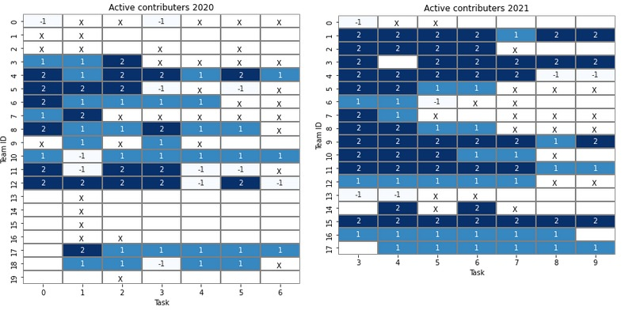
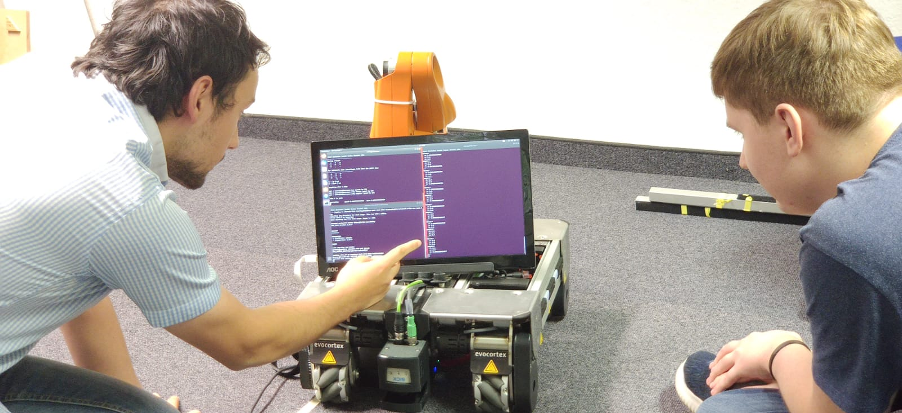

<!--

author:   Sebastian Zug & Georg Jäger
email:    sebastian.zug@informatik.tu-freiberg.de & Georg.Jaeger@informatik.tu-freiberg.de
version:  0.0.1
language: de
narrator: Deutsch Female

import: https://raw.githubusercontent.com/LiaTemplates/Rextester/master/README.md

-->

# Vorlesung Robotik Projekt

Der vorliegende Kurs realisiert die Vorlesung "Softwareprojekt" an der TU Bergakademie
Freiberg auf der Basis von LiaScript. Eine interaktive Darstellung der Inhalte ist unter

[LiaScripLink](https://liascript.github.io/course/?https://raw.githubusercontent.com/SebastianZug/SoftwareprojektRobotik/master/README.md#1)

zu finden.

| Datum      | Titel                                |
|:---------- |:------------------------------------ |
| 19.10.2021 | Einführung                           |
| 26.10.2021 | Klassen und Strukturen               |
| 02.11.2021 | Speicher und Pointer                 |
| 09.11.2021 | Templates                            |
| 16.11.2021 | Vererbung und C++ Standardbibliothek |
| 23.11.2021 | Entwurfsmodelle                      |
| 30.11.2021 | Einführung ROS2                      |
| 07.12.2021 | ROS2 Entwicklungsprozess             |
| 14.12.2021 | ROS2 Entwicklungsprozess Beispiele   |
| 21.12.2021 | ROS2 Kommunikation                   |
| 11.01.2022 | Sensoren                             |
| 18.01.2022 | Sensoren                             |
| 25.01.2022 | Sensordatenverarbeitung              |
| 01.02.2022 | Regelungstechnik                     |
| 08.02.2022 | Datenfusion                          |

## Organisatorisches (WS 2021/22)

                {{0}}
********************************************************************************

**Dozenten**

| Name          | Email                                   |
|:--------------|:----------------------------------------|
| Sebastian Zug | sebastian.zug@informatik.tu-freiberg.de |
| Georg Jäger   | georg.jaeger@informatik.tu-freiberg.de  |


********************************************************************************

                {{1}}
********************************************************************************

**Zielstellung der Veranstaltung**

Die
Veranstaltung richtet sich an Informatiker und Mathematiker und adressiert die folgenden Punkte:

+ aufbauend auf dem vorangegangenen Kurs Softwareentwicklung werden die Konzepte von C++ erläutert
+ Einführung in das Robot Operating System (ROS)
+ Gegenüberstellung von ROS1 und ROS2
+ Elemente von Robotersystemen und deren Implementierung wie

  + Grundlagen der Sensoren und deren Einbettung in ROS
  + Sensordatenverarbeitung und Fusion
  + Aktoren und deren Regelung

Die Vorlesungen und Übungen dienen der Vorbereitung auf die praktischen Aufgaben im Sommersemester.

> **Demo - ROS Integration von Sensoren**

********************************************************************************

                  {{2}}
********************************************************************************

**Prüfungsleistungen**

Die Veranstaltung ist in zwei Teile gegliedert. Im Wintersemester werden Sie
zunächst mit den Grundlagen vertraut gemacht, um :

* als Informatiker schließen Sie die Veranstaltung am Ende des Sommersemesters mit der praktischen Arbeit ab,
* als Mathematiker mit einer kleineren Aufgabe am Ende des Wintersemesters

**Zeitaufwand und Engagement**

Die Veranstaltung wird mit 9 CP in Ihrem Studienverlauf abgebildet. Entsprechend beträgt der Zeitaufwand insgesamt 270 Stunden und setzt sich aus 105h Präsenzzeit und 165h Selbststudium zusammen.

**Die eigene Beschäftigung mit der C++ Programmierung und den Konzepten von ROS ist für das erfolgreiche Bestehen der Veranstaltung unabdingbar!**

********************************************************************************

                 {{3}}
********************************************************************************

**Ablaufplan Übungen**

Wir stellen Ihnen ab November einen TurtleBot 3 zur Verfügung, den Sie für die Realsierung der Aufgaben nutzen können.

> Hallo zusammen,
>
> am nächsten Dienstag findet bereits die erste Vorlesung zum Robotik-Projekt in diesem Semester statt. Um auch den Auftakt in den  Übungsbetrieb nicht später starten zu lassen, wollen wir euch noch am selben Abend (19.10. um 18 Uhr) einen Überblick über die Inhalte und vor allem den Ablauf der Übungen geben ...
> Viele Grüße,
> Georg Jäger

Tragen Sie sich bitte in den Kurs [Softwaretechnologie-Projekt (Prototyp)](https://bildungsportal.sachsen.de/opal/auth/RepositoryEntry/18593513489/CourseNode/98504809493283) im e-learning System OPAL ein.

********************************************************************************

## Literaturempfehlungen

**Vorlesungen**

+ Vorlesung "Objektorientierte Programmierung mit C++ " der Universität Ulm (Dr. Andreas F. Borchert) [Link](https://www.uni-ulm.de/mawi/mawi-numerik/lehrenumerik/vergangene-semester/sommersemester-2018/vorlesung-objektorientierte-programmierung-mit-c/)
+ Vorlesung "Programmieren in C++" der Universität Freiburg (Frau Prof. Dr. Hannah Bast) [Link](https://ad-wiki.informatik.uni-freiburg.de/teaching/ProgrammierenCplusplusSS2018)

**Videotutorials**

+ Youtube Kanal von "The Cherno", [Link](https://www.youtube.com/playlist?list=PLlrATfBNZ98dudnM48yfGUldqGD0S4FFb)
+ Wikibooks "C++-Programmierung", [Link](https://de.wikibooks.org/wiki/C%2B%2B-Programmierung/_Inhaltsverzeichnis)

**Talks**

+ Stroustrup, Bjarne - "The Essence of C++" , [Link](https://www.youtube.com/watch?v=86xWVb4XIyE)
+ Stroustrup, Bjarne - "Learning and Teaching Modern C++", [Link](https://www.youtube.com/watch?v=fX2W3nNjJIo)

**Bücher**

+ Torsten T. Will, "C++ - Das umfassende Handbuch", Rheinwerk Computing 2019

## Ok, womit soll ich anfangen?

1. Legen Sie sich ein Repository an, mit dem Sie arbeiten!
2. Entscheiden Sie sich für Linux als Betriebssystem auf Ihrem Rechner :-), in diesem Fall sind alle Tools die Sie im Laufe des Semesters benötigen, sofort greifbar.
3. Starten Sie mit kleinen Beispielen, um Ihre algorithmischen Fähigkeiten zu schulen und sich zum anderen mit der Semantik von C++ vertraut zu machen.

Wenn Sie Punkt 2. nicht uneingeschränkt folgen wollen, hätten Sie zumindest für die Einführung zu C++ unter Windows folgende Möglichkeiten:

| Toolchain          | Link                                                                                  | Bemerkung                 |
|:------------------ |:------------------------------------------------------------------------------------- |:------------------------- |
| Visual Studio Code | [Tutorial](https://code.visualstudio.com/docs/languages/cpp)                          | für C++ Teil zu empfehlen |
| Visual Studio      |                                                                                       |                           |
| MinGW              | [MinGW Webseite](http://www.mingw.org/)                                               |                           |
| Cygwin             | [Cygwin Webseite](https://cygwin.com/)                                                |                           |
| Linux-Subsystem    | [Microsoft Dokumentation](https://docs.microsoft.com/de-de/windows/wsl/install-win10) | zu empfehlen              |
|                    | [WSL Vergleich](https://docs.microsoft.com/de-de/windows/wsl/install-win10)           |                           |

Unter cygwin muss zunächst der Compiler `gcc-g++` installiert werden. Für Rekonfigurationen und neues Pakete führen Sie einfach den Installer nochmals aus. Zudem sollten Sie in Ihrem Home einen symbolischen Link anlegen, der auf Ihren Arbeitsordner verweist.

```
$ ln -s /cygdrive/c/Users/Sebas/OneDrive/Desktop/Softwareprojekt/ mySoftware
```

<!-- width="100%" -->

<!-- width="100%" -->


Hinsichtlich Ihres Lieblingseditors haben Sie sicher schon eine Wahl getroffen :-)

## Wie können Sie zum Gelingen der Veranstaltung beitragen?

* Stellen Sie Fragen, seinen Sie kommunikativ!
* Organisieren Sie sich in Arbeitsgruppen!
* Experimentieren Sie mit verschiedenen Entwicklungsumgebung um "Ihren Editor" zu finden
* Machen Sie Verbesserungsvorschläge für die Vorlesungsfolien!

<!-- width="100%" -->

## Wie sieht es um Ihre Teamkompetenz aus?

<!-- width="70%" -->

## Sie wollen gleich starten?

1. ... als studentischer Mitarbeiter

2. ... in einem studentischen Projekt

<!-- width="100%" -->

## Los gehts ...

... mit dem Thema
